<p align="center">
  
</p>

<div align="center">

[](https://arxiv.org/abs/2509.24210)
[](https://iclr.cc/)
[](https://pypi.org/project/beyondbench/)
[](https://pepy.tech/project/beyondbench)
[](https://pypi.org/project/beyondbench/)
[](https://pypi.org/project/beyondbench/)
[](https://github.com/ctrl-gaurav/BeyondBench/actions/workflows/test.yml)
[](LICENSE)
[](https://github.com/ctrl-gaurav/BeyondBench/stargazers)

*Contamination-Resistant Evaluation of Reasoning in Language Models*

**🏆 101+ Models Evaluated &bull; 🧠 79 Reasoning Tasks &bull; 🎯 138 Variations &bull; 📊 >10<sup>15</sup> Unique Instances**

[**🌟 Explore Leaderboard**](https://ctrl-gaurav.github.io/BeyondBench/) | [**📖 Read Paper**](https://arxiv.org/abs/2509.24210) | [**📦 PyPI**](https://pypi.org/project/beyondbench/) | [**📚 Documentation**](docs/DOCUMENTATION.md)

</div>

---

## 📢 Latest News

| Date | Update |
|------|--------|
| **Apr 16, 2026** | v0.2.0 released — multi-GPU parallel eval, 1000+ tests, response caching, plugin SDK, Gradio dashboard. See [Changelog](CHANGELOG.md) |
| **Mar 6, 2026** | v0.1.0 released &mdash; FastAPI serve, CLI improvements, CI/CD, comprehensive tests. See [Changelog](CHANGELOG.md) |
| **Feb 25, 2026** | v0.0.2 released &mdash; critical bug fixes, much more stable! See [Changelog](CHANGELOG.md) |
| **Feb 25, 2026** | v0.0.1 released &mdash; 44 tasks, 117 variations, 101+ models |
| **Jan 2026** | Paper accepted at **ICLR 2026** |
| **Jan 2026** | Interactive leaderboard website launched |
| **Sep 2025** | Paper submitted: [arXiv:2509.24210](https://arxiv.org/abs/2509.24210) |

---

## 💡 What is BeyondBench?

BeyondBench introduces a **revolutionary approach** to evaluating reasoning capabilities in language models without relying on traditional static benchmarks. Our system **dynamically generates** novel problems across **79 distinct reasoning tasks** with **138 variations**, ensuring that models cannot memorize solutions and must demonstrate **true reasoning abilities**.

<div align="center">
<a href="https://ctrl-gaurav.github.io/BeyondBench/">

</a>
</div>

### 🌟 Key Highlights

<table>
<tr>
<td width="33%">

#### 🔄 **Dynamic Problem Generation**
- Problem space >10^15 unique instances
- Zero risk of data contamination
- Fresh problems on every evaluation

</td>
<td width="33%">

#### 🎯 **Three Difficulty Levels**
- **Easy**: 44 fundamental reasoning tasks
- **Medium**: 15 tasks with 59 variations
- **Hard**: 20 tasks with 78 variations

</td>
<td width="33%">

#### 🤖 **Multi-Backend Support**
- OpenAI, Gemini, Anthropic APIs
- vLLM for high-throughput local inference
- HuggingFace Transformers

</td>
</tr>
<tr>
<td width="33%">

#### 📊 **Comprehensive Metrics**
- Accuracy across difficulty levels
- Instruction-following compliance
- Token efficiency analysis

</td>
<td width="33%">

#### 🛡️ **Contamination-Resistant**
- No static benchmark memorization
- Novel problem generation
- Fair model comparison

</td>
<td width="33%">

#### ⚡ **Extensive Coverage**
- 101+ models evaluated
- Open-source and proprietary
- Regular updates with new models

</td>
</tr>
</table>

---

## 🚀 Installation

### From PyPI

```bash
pip install beyondbench
```

### From Source

```bash
git clone https://github.com/ctrl-gaurav/BeyondBench.git
cd BeyondBench
pip install -e .
```

### With Optional Dependencies

```bash
# All API clients (OpenAI, Gemini, Anthropic)
pip install beyondbench[all-apis]

# vLLM support (requires CUDA)
pip install beyondbench[vllm]

# Everything
pip install beyondbench[full]
```

```bash
# Performance optimization
pip install beyondbench[vllm]  # vLLM with prefix caching
pip install bitsandbytes       # 4-bit/8-bit quantization
```

---

## ⚡ Quick Start

### Interactive Wizard

```bash
beyondbench
```

### Command Line

```bash
# Evaluate GPT-4o on the easy suite
beyondbench evaluate --model-id gpt-4o --api-provider openai --suite easy

# Evaluate a local model with vLLM
beyondbench evaluate --model-id meta-llama/Llama-3.2-3B-Instruct --backend vllm --suite all

# Evaluate Claude on hard tasks
beyondbench evaluate --model-id claude-sonnet-4-20250514 --api-provider anthropic --suite hard

# List available tasks
beyondbench list-tasks
```

### Python API

```python
from beyondbench import EvaluationEngine, ModelHandler, TaskRegistry

# Initialize model handler
model = ModelHandler(
    model_id="gpt-4o",
    api_provider="openai",
    api_key="your-api-key"
)

# Run evaluation
engine = EvaluationEngine(model_handler=model, output_dir="./results")
results = engine.run_evaluation(suite="easy", datapoints=100)

# Print results
print(f"Average Accuracy: {results['summary']['avg_accuracy']:.2%}")
```

### API Server

```bash
# Start the BeyondBench API server
beyondbench serve --host 0.0.0.0 --port 8000

# API docs at http://localhost:8000/docs
```

### Configuration Files

```bash
# Create a config interactively
beyondbench init

# Run from config file
beyondbench run-config beyondbench/configs/default.yaml
```

### Results Viewer

```bash
# List past results
beyondbench results list

# Show detailed results
beyondbench results show ./beyondbench_results/final_results.json

# Compare two evaluations
beyondbench results compare result_a.json result_b.json

# Get task info
beyondbench info sorting
```

---

## 🔌 Supported Backends

| Backend | Models | Features |
|---------|--------|----------|
| **OpenAI** | GPT-4o, GPT-4o-mini, GPT-5, GPT-5-mini | Reasoning effort control |
| **Gemini** | Gemini 2.5 Pro, Gemini 2.5 Flash | Thinking budget configuration |
| **Anthropic** | Claude Sonnet 4, Claude Opus 4 | Latest Claude models |
| **vLLM** | Any HuggingFace model | Batch processing, tensor parallelism |
| **Transformers** | Any HuggingFace model | CPU/GPU inference |

---

## 📊 Results

### 🏆 Leaderboard (Top Models)

<table>
<thead>
<tr>
<th align="center">🏅 Rank</th>
<th align="left">🤖 Model</th>
<th align="center">📊 Overall</th>
<th align="center">🎯 Instruction Following</th>
</tr>
</thead>
<tbody>
<tr><td align="center">🥇</td><td><strong>GPT-5*</strong></td><td align="center"><strong>83.56%</strong></td><td align="center">96.15%</td></tr>
<tr><td align="center">🥈</td><td><strong>GPT-5-Nano*</strong></td><td align="center"><strong>82.04%</strong></td><td align="center">93.58%</td></tr>
<tr><td align="center">🥉</td><td><strong>GPT-5-Mini*</strong></td><td align="center"><strong>81.67%</strong></td><td align="center">94.23%</td></tr>
<tr><td align="center">4</td><td><strong>o3*</strong></td><td align="center"><strong>80.36%</strong></td><td align="center">94.96%</td></tr>
<tr><td align="center">5</td><td><strong>o4-Mini*</strong></td><td align="center"><strong>79.04%</strong></td><td align="center">95.30%</td></tr>
</tbody>
</table>

<sub>*Models marked with * use reasoning/thinking tokens. Full results for 101+ models available in the [paper](https://arxiv.org/abs/2509.24210) and on the [leaderboard](https://ctrl-gaurav.github.io/BeyondBench/).</sub>

### 🔍 Key Findings

- **Reasoning Gap**: Even top models show 20-30% performance drops on hard reasoning tasks
- **Scaling Effects**: Larger models generally perform better, but the relationship is not always linear
- **Instruction vs. Accuracy**: High accuracy does not guarantee perfect instruction-following

---

## ⚡ Performance

| Feature | Improvement |
|---------|-------------|
| **Multi-GPU Parallel Evaluation** | Up to 8x speedup on 8 GPUs |
| **Response Caching** | Near-instant repeat evaluations |
| **vLLM Prefix Caching** | 2-3x faster for shared-prefix tasks |
| **Quantization Support** | 4-bit/8-bit via bitsandbytes, GPTQ, AWQ |
| **Model Warm-up** | Eliminates cold-start overhead |

---

## 🧩 Task Suites

<details>
<summary><strong>Easy Suite (44 Tasks)</strong></summary>

| Category | Tasks |
|----------|-------|
| **Arithmetic** | sum, multiplication, subtraction, division, absolute_difference, weighted_sum, parity_check, dot_product |
| **Statistics** | mean, median, mode, running_average, moving_average, variance, standard_deviation |
| **Counting** | odd_count, even_count, count_negative, count_unique, count_greater_than_previous, count_palindromic, count_perfect_squares, count_multiples, local_maxima_count, element_frequency |
| **Extrema** | find_maximum, find_minimum, second_maximum, second_minimum, range, index_of_maximum, max_adjacent_difference, sum_of_max_indices |
| **Sequences** | sorting, longest_increasing_subsequence, alternating_sum, sum_of_digits, cumulative_sum |
| **List Operations** | reverse_list, rotate_list, interleave_lists |
| **Set Operations** | set_intersection, set_difference |
| **Comparison** | comparison |

</details>

<details>
<summary><strong>Medium Suite (15 Tasks, 59 Variations)</strong></summary>

| Task | Variations |
|------|------------|
| **Fibonacci Sequence** | 6 (Tribonacci, Lucas numbers, modified recursive) |
| **Algebraic Sequence** | 10 (Polynomial, arithmetic, quadratic) |
| **Geometric Sequence** | 10 (Exponential, compound growth, factorial) |
| **Prime Sequence** | 11 (Prime gaps, twin primes, Sophie Germain) |
| **Complex Pattern** | 12 (Interleaved, conditional, multi-rule) |
| **Arithmetic Progression** | 1 (Varying common differences) |
| **Harmonic Sequence** | 1 (Reciprocal sequences) |
| **Collatz Sequence** | 1 (3n+1 conjecture) |
| **Polynomial Evaluation** | 1 (Evaluate at given point) |
| **Matrix Operations** | 1 (2x2 multiply, determinant, inverse) |
| **Number Base Conversion** | 1 (Decimal, binary, hexadecimal) |
| **Logical Operations** | 1 (AND, OR, NOT, XOR) |
| **Pattern Completion** | 1 (Numeric pattern inference) |
| **GCD/LCM** | 1 (Greatest common divisor, least common multiple) |
| **Combinatorics** | 1 (Permutations and combinations) |

</details>

<details>
<summary><strong>Hard Suite (20 Tasks, 78 Variations)</strong></summary>

| Task | Variations | Complexity |
|------|------------|------------|
| **Tower of Hanoi** | 6 | O(2^n) moves |
| **N-Queens** | 4 | NP-complete |
| **Graph Coloring** | 10 | NP-complete |
| **Boolean SAT** | 5 | NP-complete |
| **Sudoku** | 8 | Constraint satisfaction |
| **Cryptarithmetic** | 12 | Constraint satisfaction |
| **Matrix Chain** | 5 | Dynamic programming |
| **Modular Systems** | 5 | Number theory |
| **Constraint Optimization** | 5 | Operations research |
| **Shortest Path** | 1 | Dijkstra's algorithm |
| **Knapsack** | 1 | 0/1 dynamic programming |
| **Traveling Salesman** | 1 | NP-hard combinatorial |
| **Longest Common Subsequence** | 1 | Dynamic programming |
| **Minimax Game** | 1 | Game tree search |
| **Regex Matching** | 1 | Pattern matching |
| **Topological Sort** | 1 | DAG ordering |
| **Interval Scheduling** | 1 | Greedy algorithm |
| **Coin Change** | 1 | Dynamic programming |
| **Edit Distance** | 1 | String algorithms |
| **Logic Grid Puzzles** | 8 | Deductive reasoning |

</details>

---

## 📚 Documentation

- [**Full Documentation**](docs/DOCUMENTATION.md) &mdash; Complete API reference and configuration guide
- [**Usage Guide**](docs/USAGE.md) &mdash; Detailed usage examples for all backends

### Environment Variables

```bash
export OPENAI_API_KEY="sk-..."
export GEMINI_API_KEY="..."
export ANTHROPIC_API_KEY="sk-ant-..."
```

---

## 🤝 Contributing

We welcome contributions! See the [Contributing Guide](CONTRIBUTING.md) for details.

```bash
git clone https://github.com/ctrl-gaurav/BeyondBench.git
cd BeyondBench
pip install -e ".[dev]"
pre-commit install
pytest tests/ -v
```

### 🛠️ Ways to Contribute
- **🐛 Bug Reports**: Found an issue? [Report it here](https://github.com/ctrl-gaurav/BeyondBench/issues)
- **✨ Feature Requests**: Have ideas? [Share them here](https://github.com/ctrl-gaurav/BeyondBench/issues)
- **🔧 Code Contributions**: Submit PRs for improvements
- **📚 Documentation**: Help improve our docs
- **🤖 Model Submissions**: Suggest models for evaluation

---

## 📝 Citation

If you use BeyondBench in your research, please cite our paper (accepted at **ICLR 2026**):

```bibtex
@misc{srivastava2025beyondbenchbenchmarkfreeevaluationreasoning,
      title={BeyondBench: Contamination-Resistant Evaluation of Reasoning in Language Models},
      author={Gaurav Srivastava and Aafiya Hussain and Zhenyu Bi and Swastik Roy and Priya Pitre and Meng Lu and Morteza Ziyadi and Xuan Wang},
      year={2025},
      eprint={2509.24210},
      archivePrefix={arXiv},
      primaryClass={cs.CL},
      url={https://arxiv.org/abs/2509.24210},
}
```

---

## 📞 Contact & Support

- **📧 Email**: [gks@vt.edu](mailto:gks@vt.edu), [xuanw@vt.edu](mailto:xuanw@vt.edu)
- **🐛 Issues**: [GitHub Issues](https://github.com/ctrl-gaurav/BeyondBench/issues)
- **💬 Discussions**: [GitHub Discussions](https://github.com/ctrl-gaurav/BeyondBench/discussions)

---

## 📜 License

This project is licensed under the **Apache License 2.0** - see the [LICENSE](LICENSE) file for details.

---

<div align="center">

## 🚀 Ready to Explore the Future of AI Evaluation?

<a href="https://ctrl-gaurav.github.io/BeyondBench/">

</a>

**Made with ❤️ by the BeyondBench Team**

[](https://cs.vt.edu/)
[](https://www.amazon.science/)

*Advancing the frontier of AI reasoning evaluation, one benchmark at a time* 🌟

</div>

---

<div align="center">

| 🏠 [**Home**](https://ctrl-gaurav.github.io/BeyondBench/) | 📊 [**Leaderboard**](https://ctrl-gaurav.github.io/BeyondBench/#leaderboard) | 📖 [**Paper**](https://arxiv.org/abs/2509.24210) | 💻 [**Code**](https://github.com/ctrl-gaurav/BeyondBench) |
|:---:|:---:|:---:|:---:|
| Main website | Interactive rankings | Research paper | Source code |

</div>

> **🎯 Transform your understanding of AI capabilities.** BeyondBench reveals what language models can truly reason about, beyond memorization. [**Start exploring now →**](https://ctrl-gaurav.github.io/BeyondBench/)

---

<p align="center">
  <a href="https://github.com/ctrl-gaurav/BeyondBench">
    
  </a>
</p>
